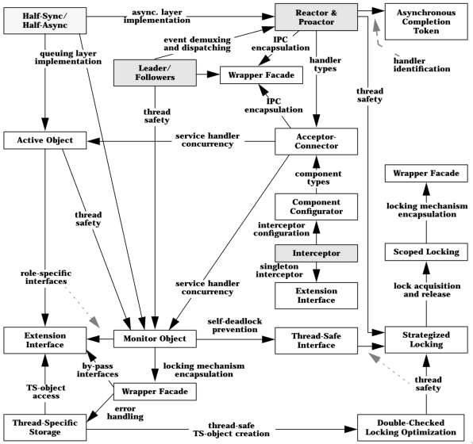
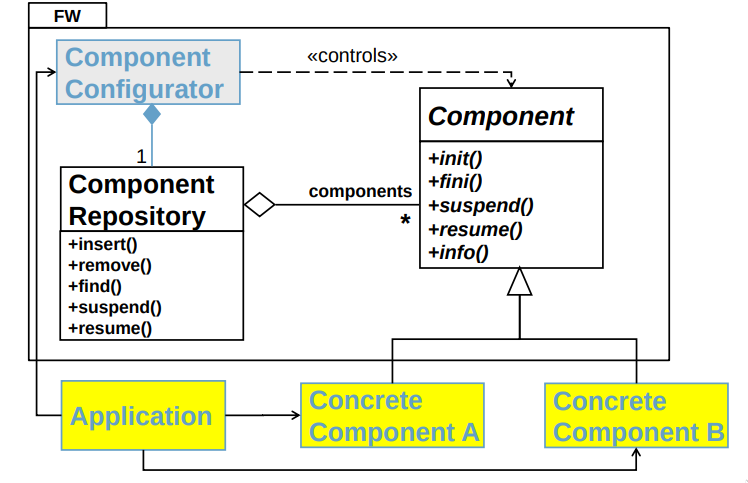
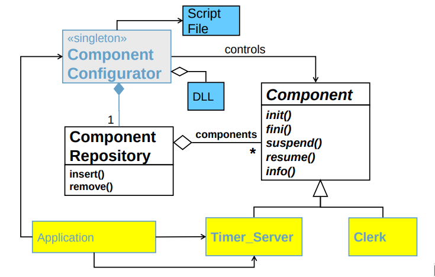
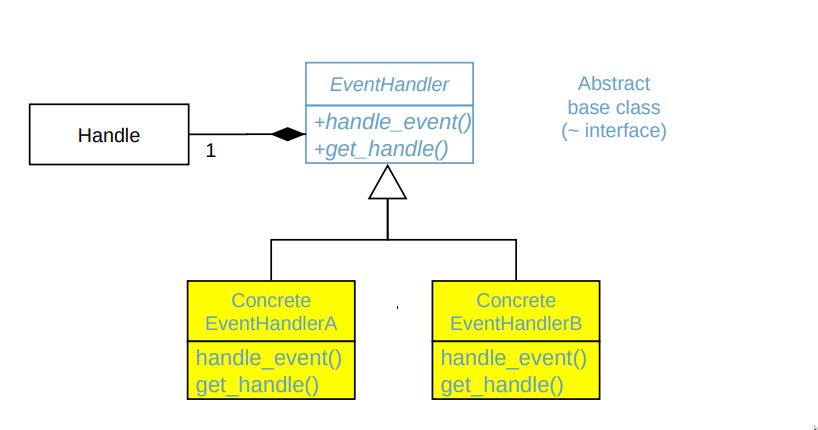
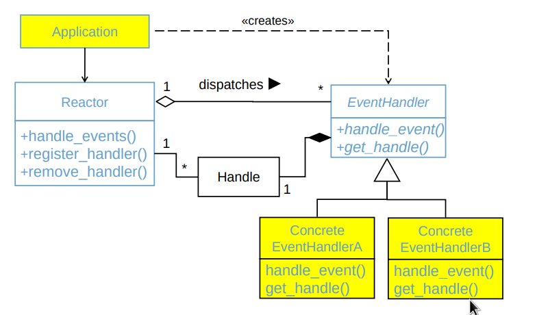
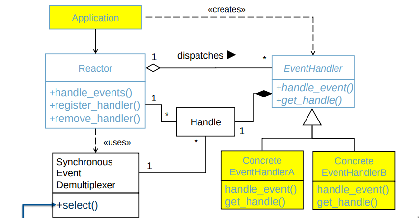
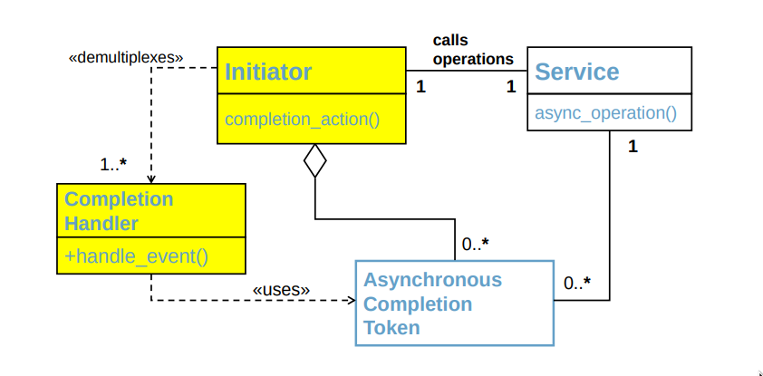
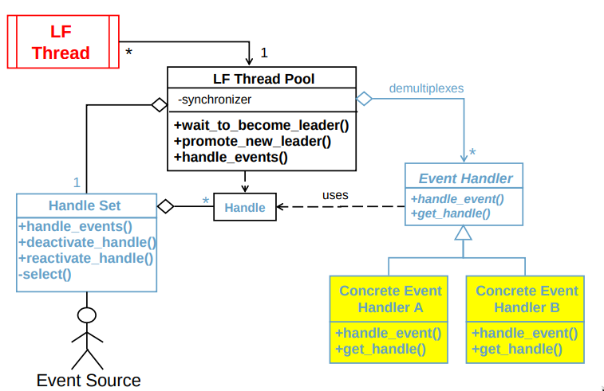
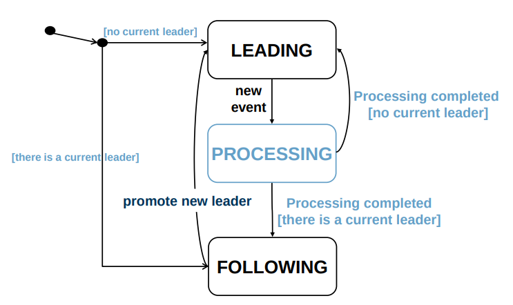

# Software Architecture for Distributed Embedded Systems
This is a summary and compilation of information provided by a Masters course at the
Technical University of Munich. This is offered by the 
[Embedded Systems and Internet of Things](https://www.ei.tum.de/en/esi/home/) chair and
was such a pleasure that I wished to transform the material into a repository for future
referral.

- Some source code examples are taken from [sourcemaking.com](https://sourcemaking.com/)
- Others are taken from [refactor.guru](https://refactoring.guru/)

This means the source files are not made by me,  please check them out and give them their props! Ultimately the content of the class and the websites themselves are based on:

* [Gang of Four Patterns](https://en.wikipedia.org/wiki/Design_Patterns)
* [Pattern Oriented Software Architecture](https://en.wikipedia.org/wiki/Pattern-Oriented_Software_Architecture) 

In case of `POSA` the chosen edition was `POSA2`.

## Chapter 1: Introduction
### Patterns
A pattern is the reusable form of a solution to a problem.

`Architecture` patterns help us to understand on a high abstraction level, a complex
software system that can be composed of interacting components.

`Design` patterns help us to implement a software system on a more detailed level using
established approaches, where the mechanics of the implementation are broken down to a
components mechanics level.

### OOP
"A-PIE"
- Abstraction
- Polymorphism
- Inheritance
- Encapsulation

### UML
The unified modeling language is an effort to standardize the definition of a software and
system architectures.

Defines thirteen different types of diagrams. Four important ones that represent different
types of interactions:

- **Structure Diagrams**, which includes the **Class Diagram**
- **Behavior Diagrams**
- **Interaction Diagrams**, which includes the **Sequence Diagram**

## Chapter 2: GoF Patterns: Intro and Structural
### Design Pattern
A design pattern is a general repeatable solution to a commonly occurring problem in
software design.

According to the GoF, there are three types of Patterns:
- `Structural patterns`
    - These are Design Patterns that ease the design by identifying a simple way to
      realize relationships between entities. They are mostly concerned with providing interfaces in a
      suitable form.
    - Patterns
        - Adapter, Bridge, Composite, Decorator, Facade, Flyweight, Proxy
- `Behavioral patterns`
    - These are design patterns that identify common communication patterns
      between objects and realize these patterns. By doing so, these patterns increase flexibility in
      carrying out this communication.
    - Patterns:
        - Chain of Responsibility, Command, Interpreter, Iterator, Mediator, Memento,
          Observer, State, Strategy, Template Method, Visitor
- `Creational patterns`
    - These are design patterns that deal with object
      creation mechanisms, trying to create objects in a manner suitable to the situation. The basic form
      of object creation could result in design problems or added complexity to the design. Creational
      design patterns solve this problem by controlling this object creation.
    - Patterns:
        - Abstract Factory, Builder, Factory Method, Prototype, Singleton

### Structural Patterns
Structural design patterns all deal with enhancing the use of interfaces to achieve certain
improvements in software architecture.

Chosen Examples: Adapter, Bridge and Proxy
#### 1. Adapter (AKA Wrapper) (~Handle-Body Idiom)
* **Summary**: Match interfaces of different classes.
* **Problem**: An "off the shelf" component offers compelling functionality that you
  would like to reuse, but its "view of the world" is not compatible with
  the philosophy and architecture of the system currently being
  developed.

* Consequences
    * `Object Adapter`: Lets a single Adapter work with many Adaptees
    * `Object Adapter`: Adapter may add functionalities to all Adaptees at once
    * `Object Adapter`: Makes it harder to override Adaptee behavior
    * `Class Adapter`: Adapts Adaptee to Target by committing to a concrete Adaptee class.
    * `Class Adapter`: Won't work when we want to adapt a class and all its subclasses.
    * `Class Adapter`: Lets Adapter override some of Adaptee's behavior.
    * `Class Adapter`: Introduces only one object, and no additional pointer indirection.

* **Intent**:
    * Convert the interface of a class into another interface clients expect. 
    * Adapter lets classes work together that couldn't otherwise because of incompatible interfaces.
    * Wrap an existing class with a new interface.
    * “Impedance match” an old component to a new system.

* **Types**: Object Adapters vs Class Adapters

See more [here](https://sourcemaking.com/design_patterns/adapter).

#### 2. Bridge
* **Summary**: Separates an object's interface from its implementation. (Handle-Body Idiom)
* **Problem**:
    * When an abstraction can have one of several possible implementations, the usual way to
      accommodate them is to use inheritance.
    * An abstract class defines the interface to the abstraction, and concrete subclasses implement it in
      different ways.
    * But this approach isn't always flexible enough: Inheritance binds an implementation to the abstraction
      permanently, which makes it difficult to modify, extend, and reuse abstractions and implementations
      independently.
    * Locks in compile-time binding between interface and implementation.
    * The abstraction and implementation cannot be independently extended or composed.

* **Intent**:
    * Decouple an abstraction from its implementation so that the two can vary independently.
    * Publish interface in an inheritance hierarchy, and bury implementation in its own inheritance hierarchy.
    * Beyond encapsulation, to insulation.

* **Relations to other Patterns**:
    * Adapter makes things work after they're designed; Bridge makes them work before they are.
    * Bridge is designed up-front to let the abstraction and the implementation vary independently while
      Adapter is retrofitted to make unrelated classes work together.

See more [here](https://sourcemaking.com/design_patterns/bridge).

#### 3. Proxy
* **Summary**: An object representing another object.
* **Problem**: You need to support resource-hungry objects, and you do not want to 
               instantiate such objects unless and until they are actually requested by the client.

* **Intent**:
    * Provide a surrogate or placeholder for another object to control access to it.
    * Use an extra level of indirection to support distributed, controlled, or intelligent access.
    * Add a wrapper and delegation to protect the real component from undue complexity

* **Types**: Virtual, Remote, Protective, Smart

* **Relations to other Patterns**:
    * An adapter provides a different interface to the object it adapts.
    * By contrast, a proxy provides the same interface as its subject.
    * However, a proxy used for access protection might refuse to perform an operation that the subject will
      perform, so its interface may be effectively a subset of the subject's.

See more [here](https://sourcemaking.com/design_patterns/proxy).

## Chapter 3: GoF Patterns: Behavioral
### Behavioral Patterns
Behavioral patterns are concerned with algorithms and the assignment of
responsibilities between objects.  They describe not just patterns of 
objects or classes but also the patterns of communication between them.

These patterns characterize complex control flow that's difficult to follow at run-time.
They shift your focus away from flow of control to let you concentrate just on the way
objects are interconnected.

Chosen Examples: Observer, Strategy and Memento

#### 1. Observer (AKA Dependants, Publish-Subscribe)
* **Summary**: A way of notifying change to a number of classes. (part of the Model-View Controller)
* **Problem**: A large monolithic design does not scale well as new graphing or 
               monitoring requirements are levied.

* **Intent**:
    * Define a one-to-many dependency between objects so that when one object changes state, all its
      dependents are notified and updated automatically.
    * Encapsulate the core (or common or engine) components in a Subject abstraction, and the variable
      (or optional or user interface) components in an Observer hierarchy.

* **Applicability**:
    * When an abstraction has two aspects, one dependent on the other.
    * Encapsulating these aspects in separate objects lets you vary and reuse them independently.
    * When a change to one object requires changing others, and you don't know how many objects need
      to be changed.
    * When an object should be able to notify other objects without making assumptions about who these
      objects are.
    * In other words, you don't want these objects tightly coupled.

* Consequences
    * needs event compression to be implemented
    * has a single Observer sometimes monitoring multiple Subjects
    * Observers may be blind to costs of changing/updating Subjects

* **Types**: Publish-Subscribe, Original GoF
* **Relations to other Patterns**:
    * Chain of Responsibility, Command, Mediator, and Observer address how you can decouple senders
      and receivers, but with different trade-offs
    * Chain of Responsibility passes a sender request along a chain of potential receivers.
    * Command normally specifies a sender-receiver connection with a subclass.
    * Mediator has senders and receivers reference each other indirectly.

See more [here](https://sourcemaking.com/design_patterns/observer).

#### 2. Memento (AKA Token)
* **Summary**: Capture and restore an object's internal state.
* **Problem**: The need to restore an object back to its previous state 
               (e.g. "undo" or "rollback" operations).

* **Intent**:
    * Without violating encapsulation, capture and externalize an object's internal state so that the object
      can be returned to this state later.
    * A magic cookie that encapsulates a "check point" capability.
    * Promote undo or rollback to full object status.

* **Applicability**:
    * Use the Memento pattern when
    * a snapshot of (some portion of) an object's state must be saved so that it can be restored to that
      state later, and
    * a direct interface to obtaining the state would expose implementation details and break the object's
      encapsulation.
    * Can implement undo and redo capabilities with use of a stack of Command objects and
      a stack of Memento objects.

* Consequences
    * Preserve encapsulation boundaries
    * Using mementos might be expensive
    * Defining narrow and wide interfaces
    * Hidden costs in caring for mementos

* **Relations to other Patterns**:
    * Command and Memento act as magic tokens to be passed around and invoked at a later time. 
    * Polymorphism is important to Command, but not to Memento because its interface is so narrow that a
      memento can only be passed as a value.
    * Command can use Memento to maintain the state required for an undo operation.
    * Memento is often used in conjunction with Iterator. 
      An Iterator can use a Memento to capture the state
      of an iteration. The Iterator stores the Memento internally.

See more [here](https://sourcemaking.com/design_patterns/memento).

#### 3. Strategy
* **Summary**: Encapsulates an algorithm inside a class.
* **Problem**: 
    * One of the dominant strategies of objectoriented design is the "open-closed
      principle".
    * Program to an interface, not an implementation!

* **Intent**:
    * Define a family of algorithms, encapsulate each one, and make them interchangeable.
    * Strategy lets the algorithm vary independently from the clients that use it.
    * Capture the abstraction in an interface, bury implementation details in derived classes.

* Consequences
    * Preserve encapsulation boundaries
    * Using mementos might be expensive
    * Defining narrow and wide interfaces
    * Hidden costs in caring for mementos

* **Relations to other Patterns**:
    * Strategy is like Template Method except in its granularity.
    * State is like Strategy except in its intent.
    * Strategy lets you change the guts of an object. Decorator lets you change the skin.
    * State, Strategy, Bridge (and to some degree Adapter) have similar solution structures. They all share
      elements of the 'handle/body' idiom. They differ in intent - that is, they solve different problems.
    * Strategy has 2 different implementations, the first is similar to State. The difference is in binding times
      (Strategy is a bind-once pattern, whereas State is more dynamic).
    * Strategy objects often make good Flyweights.

See more [here](https://sourcemaking.com/design_patterns/strategy).

## Chapter 4: GoF Patterns: Creational
### Creational Patterns
In software engineering, creational design patterns are design patterns that deal with object creation
mechanisms, trying to create objects in a manner suitable to the situation.

The basic form of object creation could result in design problems or added complexity to the design.
Creational design patterns solve this problem by controlling this object creation using indirection.

Chosen Examples: Abstract Factory, Factory Method, Singleton and Prototype

#### 1. Factory Method (AKA Virtual Constructor)
* **Summary**: Creates an instance of several derived classes.
* **Problem**: 
    * A framework needs to standardize the architectural model for a range of applications, 
      but allow for individual applications to define their own domain objects and 
      provide for their instantiation.

* **Intent**:
    * Define an interface for creating an object, but let subclasses decide which 
      class to instantiate. Factory Method lets a class defer instantiation to subclasses.
    * Defining a "virtual" constructor.
    * The new operator considered harmful.

* **Applicability**:
    * a class cant anticipate the class of objects it must create
    * a class wants its subclasses to specify the objects it creates.
    * classes delegate responsibility to one of several helper subclasses, and you want to localize the
      knowledge of which helper subclass is the delegate.

* **Relations to other Patterns**:
    * Factory Methods are usually called within Template Methods.
    * Factory Method: creation through inheritance. Prototype: creation through delegation.
    * Often, designs start out using Factory Method (less complicated, more customizable, subclasses
      proliferate) and evolve toward Abstract Factory, Prototype, or Builder (more flexible, more complex) as
      the designer discovers where more flexibility is needed.

See more [here](https://sourcemaking.com/design_patterns/factory_method).

#### 2. Abstract Factory (AKA Kit)
* **Summary**: Creates an instance of several families of classes.
* **Problem**: 
    * If an application is to be portable, it needs to encapsulate platform dependencies.
    * These "platforms" might include: windowing system, operating system, database, etc.
    * Too often, this encapsulation is not engineered in advance, and lots of #ifdef case statements with
      options for all currently supported platforms begin to procreate like rabbits throughout the code.

* **Intent**:
    * Provide an interface for creating families of related or dependent objects without specifying their
      concrete classes.
    * A factory of factories, or "super factory“.

* **Applicability**:
    * a system should be independent of how its products are created, composed, and represented.
    * a system should be configured with one of multiple families of products.
    * a family of related product objects is designed to be used together, and you need to enforce this
      constraint.
    * you want to provide a class library of products, and you want to reveal just their interfaces, not their
      implementations.

See more [here](https://refactoring.guru/design-patterns/abstract-factory).

#### 3. Singleton
One could say that Singleton is the modern descendant of global variables.
* Singleton is a creational design pattern that lets you ensure that a class has only one instance and
  provide a global access point to this instance.
* Singleton declares a static method getInstance()
  that should return the same instance of Singleton class.
* Singleton's constructor should be hidden from
  client code. getInstance() should be the only way
  to create and get Singleton objects.
* Creates a read-only global variable and ensures
  that there is only one instance created at first
  access and no duplicates exist which would be
  created with conventional constructor calls.

#### 4. Prototype
Prototype is a creational design pattern that lets you
produce new objects by copying existing ones without
compromising their internals.

* Manual Approach: Creating duplicate of an object by
  creating a fresh object of the same class, then go over all
  fields of the original object and copy their values to the
  new object.
* The Prototype pattern delegates the cloning process to
  objects themselves.
* It declares the common interface for all objects that allow
  cloning. It allows cloning objects without tight coupling to
  their concrete classes. Usually, the prototype interface
  contains a single clone method.

## Chapter 5: POSA2 Patterns: Intro, WF, Reactor and ACT
According to POSA2, there are four types of Patterns for Distributed and Embedded
Applications:
- <a href="" target="">`Service Access and Configuration Patterns`</a>
    * The `Wrapper Facade` design pattern encapsulates the functions and data provided by 
      existing nonobject-oriented APIs within more concise, robust, portable, maintainable, and 
      cohesive objectoriented class interfaces.
    * The `Component Configurator` design pattern allows an application to link and unlink its component
      implementations at run-time without having to modify, recompile, or statically relink the application.
      Component Configurator further supports the reconfiguration of components into different application
      processes without having to shut down and re-start running processes.
    * The `Interceptor` architectural pattern allows services to be added transparently to a framework and
      triggered automatically when certain events occur.
    * The `Extension Interface` design pattern allows multiple interfaces to be exported by a component, to
      prevent bloating of interfaces and breaking of client code when developers extend or modify the
      functionality of the component.

- <a href="" target="">`Concurrency Patterns`</a>
    * The `Active Object` design pattern decouples method execution from method invocation to enhance
      concurrency and simplify synchronized access to objects that reside in their own threads of control.
    * The `Monitor Object` design pattern synchronizes concurrent method execution to ensure that only one
      method at a time runs within an object. It also allows an object's methods to cooperatively schedule
      their execution sequences.
    * The `Half-Sync/Half-Async` architectural pattern decouples asynchronous and synchronous service
      processing in concurrent systems, to simplify programming without unduly reducing performance. The
      pattern introduces two intercommunicating layers, one for asynchronous and one for synchronous
      service processing.
    * The `Leader/Followers` architectural pattern that provides an efficient concurrency model where
      multiple threads take turns sharing a set of event sources in order to detect, demultiplex, dispatch,
      and process service requests that occur on the event sources.
    * The `Thread-Specific Storage` design pattern allows multiple threads to use one 'logically global'
      access point to retrieve an object that is local to a thread, without incurring locking overhead on each
      object access.

- <a href="" target="">`Event Handling Patterns`</a>
    * The `Reactor`architectural pattern allows event-driven applications to demultiplex and dispatch service
      requests that are delivered to an application from one or more clients.
    * The `Proactor` architectural pattern allows event-driven applications to efficiently demultiplex and
      dispatch service requests triggered by the completion of asynchronous operations, to achieve the
      performance benefits of concurrency without incurring certain of its liabilities.
    * The `Asynchronous Completion Token` design pattern allows an application to demultiplex and process
      efficiently the responses of asynchronous operations it invokes on services.
    * The `Acceptor-Connector` design pattern decouples the connection and initialization of cooperating
      peer services in a networked system from the processing performed by the peer services after they
      are connected and initialized.

- <a href="" target="">`Synchronization Patterns`</a>
    * The `Scoped Locking` C++ idiom ensures that a lock is acquired when control enters a scope and
      released automatically when control leaves the scope, regardless of the return path from the scope.
    * The `Strategized Locking` design pattern parameterizes synchronization mechanisms that protect a
      component's critical sections from concurrent access.
    * The `Thread-Safe Interface` design pattern minimizes locking overhead and ensures that 
      intracomponent method calls do not incur 'self-deadlock' by trying to reacquire 
      a lock that is held by the component already.
    * The `Double-Checked Locking Optimization` design pattern reduces contention and synchronization
      overhead whenever critical sections of code must acquire locks in a thread-safe manner just once
      during program execution

    

### Service Access and Configuration Patterns
#### 1. Wrapper Facade Pattern (Example: Encapsulating Low-Level OS API's)
* **Summary**:
    * The `Wrapper Facade` design pattern encapsulates the functions and data provided by 
      existing nonobject-oriented APIs within more concise, robust, portable, maintainable, and 
      cohesive objectoriented class interfaces.
* **Context**:
    * An IoT logging server must manage a variety of OS services, including processes, threads, socket
      connections, virtual memory, & files.
    * Most operating systems provide low-level APIs written in C to access these services

* **Problem**: 
    * The diversity of hardware & operating systems makes it hard to build portable and robust server
      software by programming directly to low-level operating system APIs, which are
    * tedious,
    * error-prone and
    * non-portable.

* **Solution**: Applied to avoid accessing low-level operating system APIs directly 

* **Implementation**: 
    1. Identify the cohesive abstractions and relationships among existing low-level APIs
    2. Cluster cohesive groups of functions into wrapper facade classes and methods
    3. Consider allowing applications controlled access to implementation details
    4. Develop an error-handling mechanism
    5. Develop related helper classes (optional)

* **Consequences**:
    * Concise, cohesive & robust higher-level object-oriented programming interfaces
    * Portability & maintainability
    * Modularity, reusability & configurability
    * Loss of functionality
    * Performance degradation
    * Programming language & compiler/interpreter limitations

#### 2. Component Configurator Pattern
* **Summary**:
    * The `Component Configurator` design pattern allows an application to link and unlink its component
      implementations at run-time without having to modify, recompile, or statically relink the application.
    * It also further supports the reconfiguration of components into different
      application processes without having to shut down and re-start running processes.
* **Context**:
    * An application or system (e.g. with 24-7 operation) in which components must be initiated,
      suspended, resumed, and terminated as flexibly and transparently as possible

* **Problem**: 
    * Changes to component functionality or implementation details are common in many systems
        * it should be possible at any time to modify component implementation
    * The most effective way to collocate or distribute components into processes and hosts is often not
      known
    * Administrative tasks should be straightforward and component-independent

* **Solution**: 
    * Decouple component interface from component implementation
        * A component defines a uniform interface for configuring and controlling
    * Concrete components are packed into a suitable unit of configuration e.g. a DLL
    * This DLL can be dynamically linked and unlinked into and out of an application

* **Implementation**: 
    1. Define the component configuration and control interface
    2. Implement a component repository
    3. Implement the component (re)configuration mechanism
    4. Implement the concrete components

* **Consequences**:
    * Uniformity
    * Centralized administration
    * Modularity, testability & reusability
    * Configuration dynamism & control
    * Tuning and optimization
    * Lack of determinism and ordering dependencies
    * Reduced security and reliability
    * Increased run-time overhead and infrastructure complexity
    * Overly narrow common interfaces

<table>
    <tr>
        <td>
             
        </td>
        <td>
             
        </td>
    </tr>
</table>

### Event Handling Patterns
Chosen Examples: Reactor and Asynchronous Completion Token
#### 1. Reactor
* **Summary**:
    * The `Reactor`architectural pattern allows event-driven applications to demultiplex and dispatch service
      requests that are delivered to an application from one or more clients.

* **Context**:
    * Consider an event-driven application that receives multiple service requests simultaneously, but
      processes them synchronously and serially.

* **Problem**: 
    * Server applications in a distributed system must handle multiple 
      clients that send them service requests.
    * It might not be efficient and scalable to have a separate thread per client.

* **Solution**:
    * Synchronously wait for the arrival of indication events on one or more event sources (e.g. connected
      socket handles).
    * Demultiplex and dispatch the events to services that process them.
    * Perform the application specific functionality in service handlers.

* **Implementation**:
    1. Define the event handler interface
    2. Define the reactor interface
    3. Implement the reactor interface
    4. Determine the number of reactors needed in an application
    5. Implement the concrete event handlers

* **Consequences**:
    * Separation of concerns
    * Modularity, reusability, & configurability
    * Portability
    * Coarse-grained concurrency control
    * Restricted applicability
    * Non-preemptive
    * Complexity of debugging & testing

<table>
    <tr>
        

            
        

        <td>
             
        </td>
        <td>
             
        </td>
    </tr>
</table>

#### 2. Asynchronous Completion Token (ACT)
* **Summary**:
    * The `Asynchronous Completion Token` design pattern allows an application to demultiplex and process
      efficiently the responses of asynchronous operations it invokes on services.

* **Context**:
    * An event-driven system in which applications invoke operations asynchronously on services and
      subsequently process the associated service completion event responses

* **Problem**: 
    * A client application invokes one or more services asynchronously
    * Each service returns its response via a completion event
    * The client application must demultiplex this event to the appropriate handler (as fast as possible)

* **Solution**:
    * Together with each asynchronous operation invocation:
        * transmit information that identifies how the initiator should process the service’s response
            * create an Asynchronous Completion Token (ACT)
            * the ACT is passed to the service, which holds it – but does not modify it
        * Return this information to the initiator when the operation finishes
        * The initiator uses the ACT to identify the completion handler

* **Implementation**:
    1. Define the ACT representation
    2. Select a strategy for holding the ACT at the initiator
    3. Determine how to pass the ACT from the initiator to the service
    4. Determine a strategy for holding the ACT in the service
    5. Determine the number of times an ACT can be used
    6. Determine the initiator strategy for demultiplexing ACTs to completion handler hook methods

* **ACT Representation**: Pointer ACT's, Object Reference ACT's, Index ACT's, Implicit ACT's, 
                          Explicit ACT's
* **Demultiplexing Strategy**: Queued Completion Events vs Callbacks

* **Consequences**:
    * Simplified initiator data structures
    * Efficient state acquisition (time efficient)
    * Space efficiency
    * Flexibility
    * Non-dictatorial concurrency policies
    * Memory leaks
    * Authentication Needed
    * Application re-mapping

### Concurrency Patterns
#### 1. Leader/Followers Pattern
* **Summary**:
    * The `Leader/Followers` architectural pattern that provides an efficient concurrency model where
      multiple threads take turns sharing a set of event sources in order to detect, demultiplex, dispatch,
      and process service requests that occur on the event sources.
    * This pattern eliminates the need for and the overhead of a
      separate Reactor thread & synchronized request queue
      used in the Half-Sync/Half-Async pattern.

* **Context**:
    * An event-driven application where multiple service requests arriving on a set of event sources must be
      processed efficiently by multiple threads that share the event sources

* **Problem**: 
    * It is hard to implement high-performance multi-threaded server applications
    * These applications process high volumes of multiple event types, such as CONNECT, READ and
      WRITE
    * Context switching overhead
    * Dynamic memory allocation
    * Multiple threads calling select

* **Solution**:
    * Structure a pool of threads to share a set of event sources efficiently by taking turns demultiplexing
    events and synchronously dispatching the events to application services that process them
    * allow one leader thread to wait for an event
    * other follower threads can queue up waiting for their turn
    * after detecting an event – the leader promotes a follower to leader. It then plays the role of a
      processing thread

* **Implementation**:
    1. Choose the handle and handle set mechanisms
    2. Implement a protocol for temporarily (de)activating handles in a handle set
    3. Implement a thread pool
    4. Implement a protocol to allow threads to initially join (and later rejoin) the thread pool
    5. Implement the follower promotion protocol
    6. Implement the event handlers

* **Consequences**:
    * Performance enhancements 
    * Programming simplicity
    * Implementation complexity
    * Lack of flexibility
    * Network I/O bottlenecks

* **Alternatives**:
    * Use Reactor when each event requires a short amount of time to process
        * Reactor is also a part of Leader/Followers
    * Use Proactor when the OS supports asynchronous I/O effectively
    * Use Half-Sync/Half-Async or Active object
        * when there are additional synchronization or ordering constraints
        * when event sources cannot be waited for by a single event demultiplexer

    

    

