# TutorialPlantUML

A simple project containing: 
- cheetsheat for the the `PlantUML` language, initially based on [this](https://ogom.github.io/draw_uml/plantuml/).
- quick main points to the use of `UML` in `OOP` development/architecture.
- within the `example` folder, the use of `plantuml`, common `OOP` relationships, `patterns` and even a toy smart app example which groups many of these
topics into a single file is showcased.

## PlantUML

### 1. Basics
- title
- images `()` and `[]`
- notes

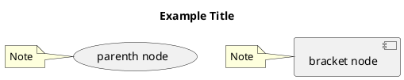

#### Draw
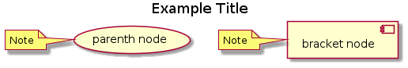

### 2. Participants
- actor
- boundary
- control
- entity
- database

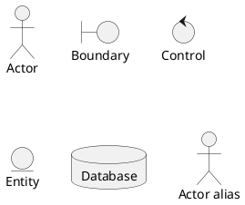
#### Draw
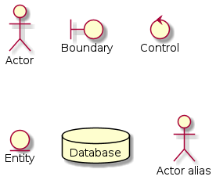

### 3. Arrows
- arrows
    - Can be expressed with `->` and their direction may be specified as: `-direction>`.
    - `->` can be interpreted as *Use*
    - `.>` can be interpreted as *Extend or Include*

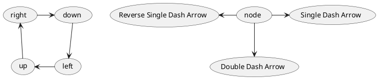
#### Draw
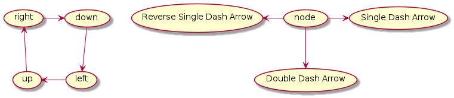

### 4. Activities / States
|  keyword          |     usage		   |
| -------------     | -------------    |
|    `" "`		    |     Activity     |
|    `(*) ->`		|     Initial Act. |
|    `-> (*)`		|     Final Act.   |
|    `[*] ->`		|     Initial St.  |
|    `-> [*]`		|     Final St.    |


#### Activities
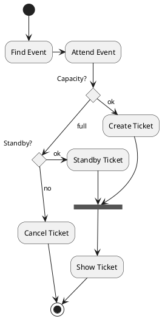
##### Draw
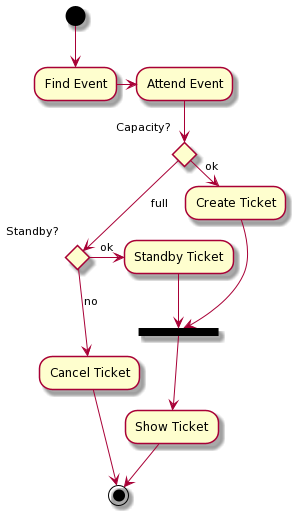

#### States
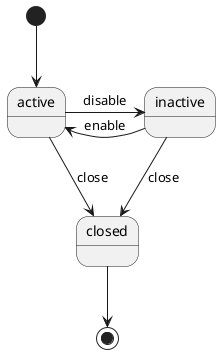
##### Draw
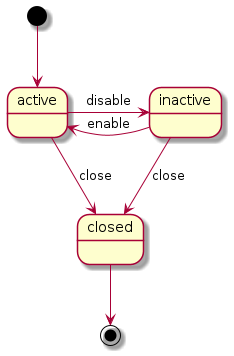

### 5. Sequence
Represent the messages and orders of the interacts.
|  keyword      |     usage		|
| ------------- | ------------- |
|    `->`		|     Message   |
|    `<--`		|     Return    |

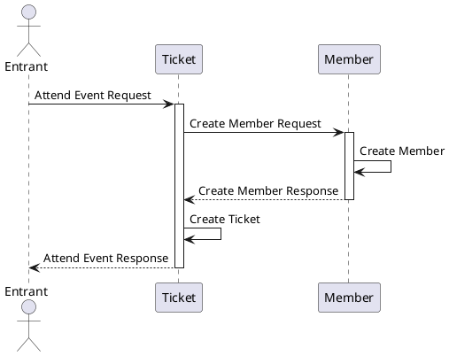
#### Draw
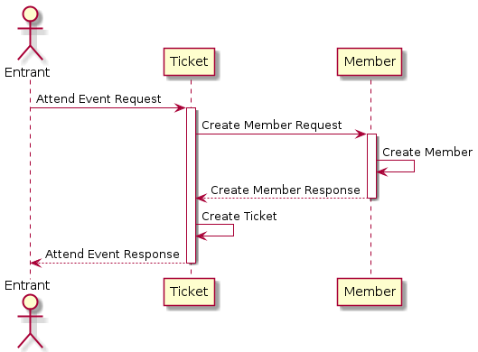

### 6. Objects
Represent the logical view of the object.
|  keyword      |     usage		   |
| ------------- | -------------    |
|    `object`   |     Object       |
|    `<\-`		|     Extension    |
|    `*-`		|     Composition  |
|    `o-`		|     Agregation   |

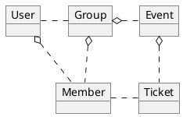
#### Draw
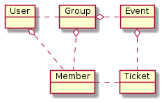

### 7. Classes
Represent the logical view of the class.
|  keyword      |     usage		|
| ------------- | ------------- |
|    `class`    |     Class     |
|    `+`		|     Public    |
|    `-`		|     Private   |
|    `#`		|     Protected |
|    `~`		|     Package   |

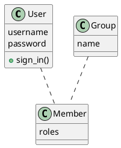
#### Draw
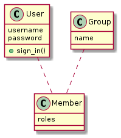

### 8. Components
Represent the dependency of the components.
|  keyword          |     usage		|
| -------------     | ------------- |
|    `[ ]`          |     Class     |
|    `package`		|     Package   |
|    `frame`		|     Frame     |
|    `folder`		|     Folder    |
|    `database`		|     Database  |
|    `node`		    |     Node      |
|    `cloud`		|     Cloud     |

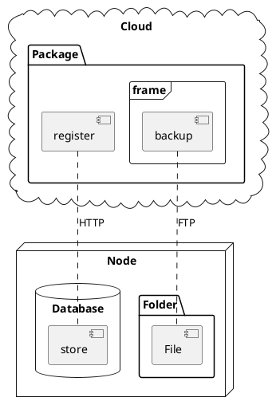
#### Draw
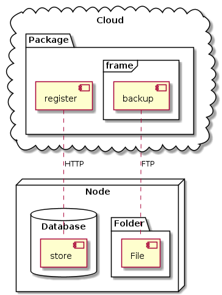

### 9. Colors
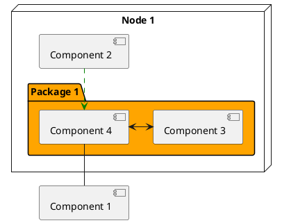
#### Draw
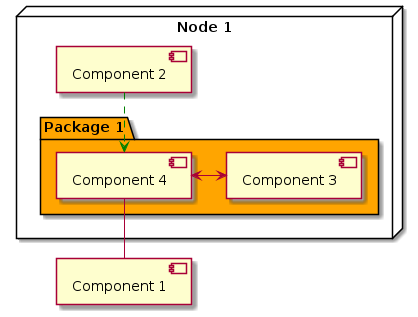

### 10. Legends
```plantuml
@startuml

legend
    |= Color |= Type |= Description |
    | <size:11><back:#Crimson>           </back></size>|    <&arrow-right> | Example 1 |
    | <size:11><back:#LightSeaGreen>           </back></size>|    <&arrow-right> | Example 2 |
    | <size:11><back:#DarkGreen>           </back></size>|    <&arrow-right> | Example 3 |
    | <size:11><back:#YellowGreen>           </back></size>|    <&box> | Example 4 |
    | <size:11><back:#Chocolate>           </back></size>|    <&box> | Example 5 |
endlegend

@enduml
```
#### Draw
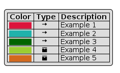

### 11. Sprites and Includes
```plantuml
@startuml

!include <font-awesome/common>

!define ICONURL https://raw.githubusercontent.com/Roemer/plantuml-office/master/office2014
!includeurl ICONURL/Servers/application_server.puml

' =================
' == Declaration ==
' =================

OFF_APPLICATION_SERVER([Component 1], "Component 1", component, #Green)

node "Node 1" {
    package "Package 1" #Orange {
        OFF_APPLICATION_SERVER([Component 4], "Component 4")
        OFF_APPLICATION_SERVER(Component3, "Component 3", component)
    }
    OFF_APPLICATION_SERVER([Component 2])
}


' ====================
' == Implementation ==
' ====================


node "Node 1" {
    [Component 2] .[#Green]-> [Component 4]
    Component3 <-left-> [Component 4]
    [Component 4] -- [Component 1]
}

@enduml
```

### 12. Constants
```plantuml
@startuml
!define ${VARIABLE NAME} ${VARIABLE VALUE}
@enduml
```

## UML

### 1. UML Diagram
Structure x Behavior

#### 1.1 Structure Diagram
Shows the **static structure** of the system and its parts on different abstraction and
implementation levels and how they are related to each other. The elements in a
structure diagram represent the meaningful concepts of a system, and may include
abstract, real world and implementation concepts.
- Class Diagram
- Object Diagram
- Package Diagram
- Component Diagram
- Deployment Diagram
- Profile Diagram

##### 1.1.1 Class Diagram
A UML structure diagram which shows structure of the designed system at the level of
classes and interfaces, shows their features, constraints and relationships.

Relationships:
- `association` is a relationship between classifiers which is used to show that instances of classifiers could be either linked to each other or combined logically or physically into some aggregation.
    - `N-ary assocation`
    - `binary assocation`
        - `aggregation`: Example would be a triangle is an aggregation of three sides.
        - `composition`

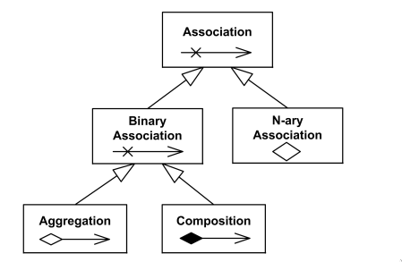


- `generalization` is a binary taxonomic (i.e. related to classification) directed relationship between a more general classifier (superclass) and a more specific classifier (subclass). Inheritance is interpreted as a OOP specific type of generalization.

- `dependency` is a directed relationship which is used to show that some UML element or a set of elements requires, needs or depends on other model elements for specification or implementation. Because of this, dependency is called a supplier - client relationship, where supplier provides something to the client, and thus the client is in some sense incomplete while semantically or structurally dependent on the supplier element(s). Modification of the supplier may impact the client elements.

#### 1.2 Behavior Diagram

Shows the **dynamic behavior** of the objects in a system, which can be described as a
series of changes to the system over time.
- UseCase Diagram
- Activity Diagram
- State Machine Diagram
- Interaction Diagram
    - Sequence Diagram
    - Communication Diagram
    - Timing Diagram
    - Interaction Overview Diagram
